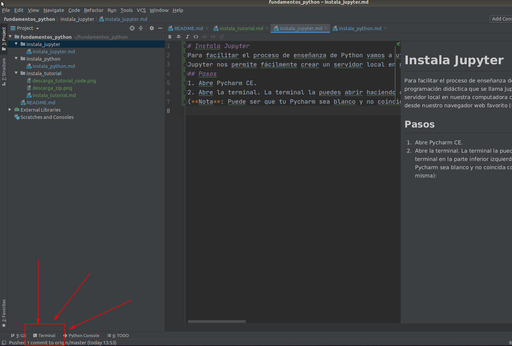

# Instala Jupyter
Para facilitar el proceso de enseñanza de Python vamos a utilizar una herramienta de programación didáctica que se llama Jupyter.
Jupyter nos permite fácilmente crear un servidor local en nuestra computadora con el cual podemos visualizar los ejercicios desde nuestro navegador web favorito (Firefox, Google Chrome, Safari, etc.).  
## Pasos
1. Abre Pycharm CE.
2. Abre la terminal. La terminal la puedes abrir haciendo click en el botón de terminal en la parte inferior izquierda de Pycharm
(**Nota**: Puede ser que tu Pycharm sea blanco y no coincida con la foto pero la ubicación del botón es la misma):  

3. Copia y pega el siguiente comando en la terminal (**NOTA**: Usa ctrl+C para copiar y Ctrl+V para pegar en Windows 10 o Linux. Usa ⌘+C para copiar y ⌘+V para pegar en Mac):
    ```shell script
    pip3 install notebook
    ```
4. Una vez que termine de correr, copia y pega el siguiente comando:
    ```shell script
    jupyter notebook
    ```
5. Esto debe de abrir una pestaña en tu navegador predeterminado. Haz click en el folder de Notebooks y ya puedes empezar el curso!al a