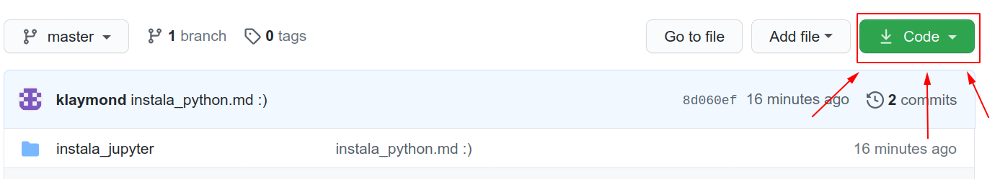

# Instala este tutorial

1. Para instalar este tutorial primero dale click al botón verde del lado superior derecho:  
  
2. Luego descarga el ZIP:  

## Windows 10
1. Abre la carpeta de "Descargas" y dale click derecho al ZIP que acabas de descargar
2. Dale click izquierdo a "Extraer todo" y elige tu escritorio como el folder destino
3. Abre Pycharm CE
4. En "Archivo->Abrir" busca tu escritorio, selecciona la carpeta "fundamentos_python" y dale click al botón de "Seleccionar"

## MacOS
1. Abre la carpeta de "Descargas" y dale doble click al ZIP que acabas de descargar
2. Ahora tienes una carpeta que se llama fundamentos_python en tus Descargas
3. Arrastrala a tu Escritorio
4. Abre Pycharm CE 
5. En "Archivo->Abrir" busca tu escritorio, selecciona la carpeta "fundamentos_python" y dale click al botón de "Seleccionar"

## Linux
Crea una cuenta de Github, descarga Git desde tu consola y clona el repositorio en tu carpeta de Home. Después abre el directorio "fundamentos_python" desde Pycharm CE.